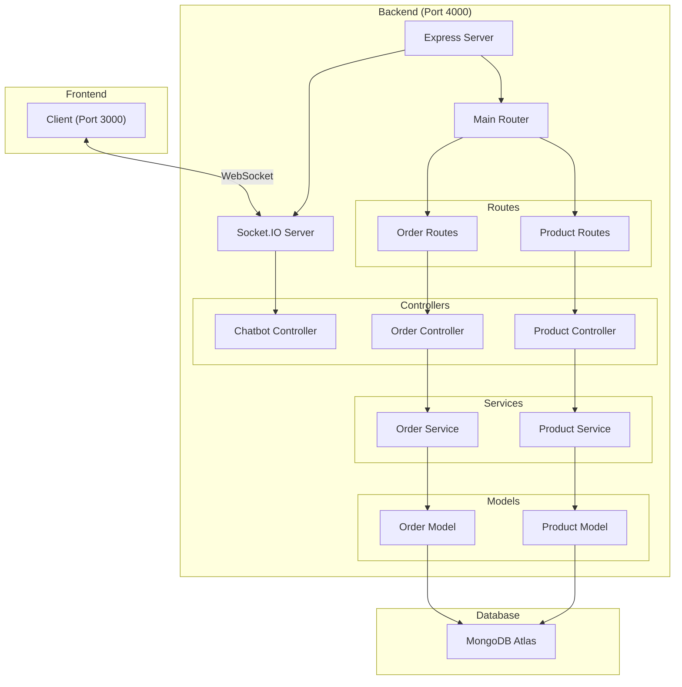

# Sushi Chatbot

Un chatbot simple que utiliza **Socket.IO** para comunicación en tiempo real.

Ejemplos de frases que entiende el bot:

-   "Hola!"
-   "**Quiero** **pedir**/**ordenar** XXXXX"
-   "Cual es su **domicilio**/**direccion**/**ubicacion**?"
-   "**Horario** de atencion?"
-   "Quiero ver el **menu**"

El server guarda temporalmente las sesiones de los clientes conectados.
Cuando un cliente hace un pedido, el bot pregunta por el nombre del mismo y guarda la orden final en la DB.

Las órdenes creadas se pueden obtener vía API REST con GET /api/chatbot/orders



## Requisitos

Antes de empezar, asegurarse de tener instalado:

-   **Node.js** (v14 o superior)

-   **Yarn** (Para lanzar el cliente, ya que es mas rápido y eficiente con Vite)

---

## Instalación

1. Clonar este repositorio:

    ```bash
    git clone https://github.com/martinlpc/chatbot-nular
    cd chatbot-nular
    ```

2. Instalar las dependencias para el backend y el frontend

### Backend

1. Ir al directorio del backend:

    ```bash
    cd backend
    ```

2. Instalar las dependencias:

    ```bash
    npm i
    ```

3. Configurar las variables de entorno:

    Crear un archivo `.env.example` en el directorio `backend` con el siguiente contenido:

    ```
    PORT=4000
    MONGO_URL= <TuMongoURL>
    ```

    O cargar el archivo recibido por el desarrollador

4. Iniciar el servidor:

    ```bash
    npm start
    ```

    El servidor estará disponible en http://localhost:4000

### Frontend

1. Ir al directorio del frontend:
    ```bash
    cd frontend
    ```
2. Instalar dependencias:
    ```bash
    yarn install
    ```
3. En caso de ser necesario, configurar el archivo `vite.config.js` para que el front use el puerto 3000

4. Iniciar el servidor de desarrollo:
    ```bash
    yarn dev
    ```
    El frontend estará disponible en http://localhost:3000

## Uso

1. Ingresar al frontend en http://localhost:3000
2. Introducir un mensaje para enviar al chatbot
3. Los mensajes se procesan en tiempo real

## Tecnologías utilizadas

-   Frontend: Vite, React.js, Socket.IO-client
-   Backend: Node.js, Express, Socket.IO
-   Database: MongoDB Atlas (cloud storage)
